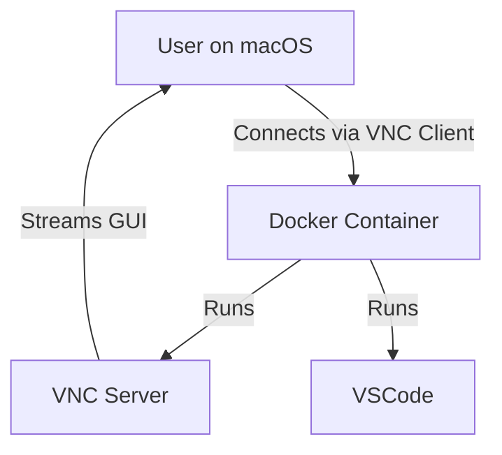

# Docker VSCode with GUI Access Plan

This document outlines the plan to build a Docker image with Visual Studio Code (VSCode) and a GUI accessible via a common remote desktop solution, focusing on a simple container setup for testing purposes.

## Goals
1. **Docker Image Creation**: Build a Docker image with VSCode and a GUI accessible via a common remote desktop solution.
2. **Local Testing**: Test the Docker container locally to ensure functionality and GUI access.
3. **Remote Desktop Access**: Enable users to connect to the container's GUI using a standard VNC client on macOS.

## Step-by-Step Plan

### 1. Docker Image Creation
- **Base Image**: Use Ubuntu 22.04 as the base image for compatibility with VSCode and GUI components.
- **VSCode Installation**: Install the latest stable version of Visual Studio Code, as per the existing Dockerfile.
- **GUI Setup**: Install a lightweight desktop environment like XFCE or LXDE, along with a VNC server (e.g., TightVNC or TigerVNC) for remote GUI access.
- **User Configuration**: Set up a non-root user (`vscodeuser`) for running VSCode and the VNC server.
- **Entrypoint Script**: Create a script to start the VNC server and VSCode when the container launches. Ensure the script sets up a VNC password for basic security.

### 2. Local Testing
- **Build and Run**: Build the Docker image locally and run a container to verify the setup.
- **GUI Connection Test**: Use a VNC client (e.g., RealVNC Viewer or the built-in Screen Sharing on macOS) to connect to the VNC server running in the container and confirm VSCode GUI accessibility.
- **Functionality Test**: Verify that VSCode operates correctly within the container, including any specified extensions.

### 3. Remote Desktop Access for macOS
- **Client Application**: Recommend using the built-in Screen Sharing app on macOS or a third-party VNC client like RealVNC Viewer to connect to the container's VNC server.
- **Connection Instructions**: Provide users with instructions on how to connect to the container's IP address and port (typically 5901 for VNC) with the configured VNC password.
- **Port Mapping**: Ensure the Docker run command maps the container's VNC port (e.g., 5901) to a host port for external access.
- **Security**: Note that VNC connections should be secured further if exposed to the internet, possibly using SSH tunneling or a VPN, though this is outside the current scope.

## Architecture Diagram
Below is a Mermaid diagram illustrating the architecture for the Docker container with VNC for GUI access:

This diagram shows a user connecting to a Docker container via a VNC client on macOS. The container runs both a VNC server for GUI access and VSCode.